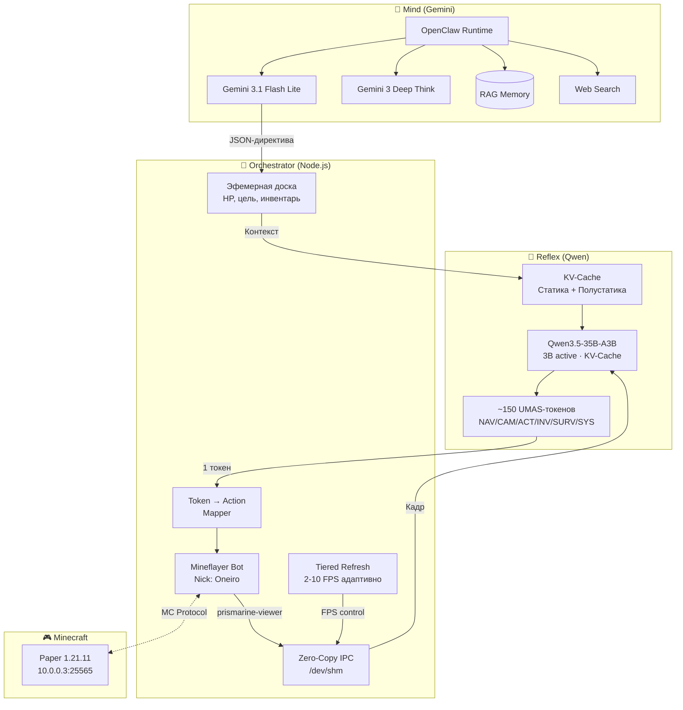
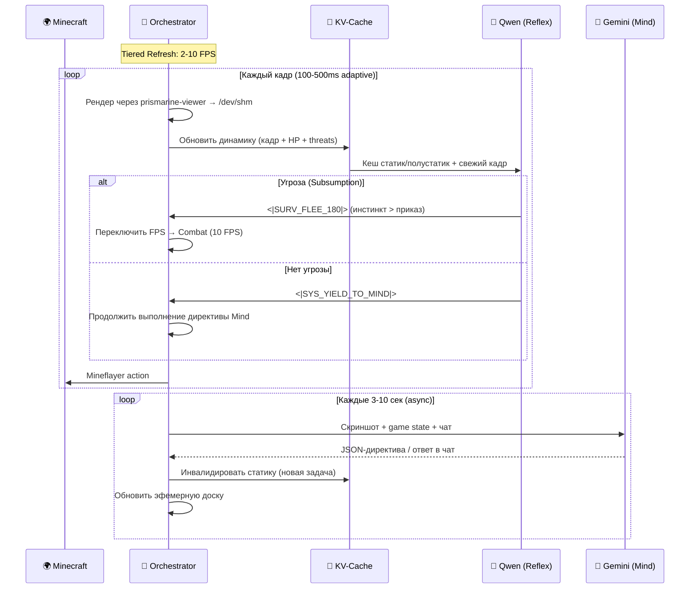

# 🌙 Архитектура Oneiro — Dual-Agent VLA

> **Vision-Language-Action** — два агента, один оркестратор, ноль модов
> Обновлено: 2026-03-30

---

## Обзор

Oneiro — embodied VLA-агент, состоящий из **двух нейросетевых агентов** и **одного скрипта-оркестратора**. В отличие от однопоточных LLM-ботов (Mindcraft, Voyager), Oneiro разделяет **быстрые рефлексы** и **медленное планирование** на разные модели, вдохновляясь биологической нервной системой.

### Позиционирование среди VLA-агентов

| Агент | Подход | Action Space | Ограничения |
|---|---|---|---|
| **Voyager** (2023) | GPT-4 → JS код | High-level API (Mineflayer) | Нет зрения (текстовый стейт), медленный |
| **STEVE-1** (2024) | VPT + MineCLIP | Low-level (клавиатура/мышь) | Нет языка, нет планирования |
| **GROOT** (2024) | Video Encoder-Decoder | Low-level (клавиатура/мышь) | Учится из видео, нет инструкций |
| **JARVIS-VLA** (2025) | VLM + Action Head | Behavior tokens | Единая модель, нет разделения рефлекс/план |
| **OmniJARVIS** (2025) | Unified tokenization | Behavior tokens | Всё в одном трансформере (тяжёлый) |
| **OpenHA** (2025) | Chain of Action | Hierarchical | Ближе к нам, но monolithic VLA |
| **Oneiro** (2026) | **Dual-Agent + Subsumption** | **UMAS макро-токены** | Наш подход ↓ |

**Ключевое отличие Oneiro:** Разделение на Reflex (Qwen, <100ms) и Mind (Gemini, 3-10s) позволяет **одновременно** иметь быстрые инстинкты И глубокое планирование. JARVIS не может убежать от крипера за 100ms, потому что его единственная модель занята генерацией chain-of-thought.

---

## Агенты

### 🦴 Агент 1: Oneiro Reflex (Моторная кора)

| Параметр | Значение |
|---|---|
| **Модель** | Qwen3.5-35B-A3B (Sparse MoE) |
| **Активных параметров** | ~3B из 35B |
| **Режим** | `enable_thinking: false` |
| **Латентность** | < 100ms (с KV-Cache: ~30-50ms) |
| **Вход** | Кадр + полный контекст (задача, инвентарь, угрозы, директива) |
| **Выход** | Один UMAS макро-токен |
| **Где работает** | Google Cloud TPU v7 Ironwood (1 чип, 192 GB HBM) |
| **Inference mode** | `max_new_tokens=1` + **Static Logit Bias** (тензор-маска) |

**Роль:** Не тупая болванка, а **осознанный рефлекс**. Модель видит полный контекст: что она делает, какая глобальная задача, куда идёт, что в инвентаре. Но **решает мгновенно** — один токен за один forward pass.

> ⚠️ **Logit Bias:** На inference модель может выбирать ТОЛЬКО из ~150 UMAS-токенов
> через **Static Logit Bias** (тензор-маска: UMAS = 0, остальные = -inf). Это исключает галлюцинации без overhead.
>
> ⚠️ `prefix_allowed_tokens_fn` нельзя на TPU — динамические Python-функции
> ломают графы XLA (Host-Device Sync → 500ms+). Static Logit Bias вшивается
> в `lm_head` при компиляции графа. Overhead: **0ms**.

---

### 🧠 KV-Cache + Tiered Refresh (Богатый контекст без потери скорости)

**Проблема:** Как дать рефлексовой модели полный контекст и не убить 100ms?

**Решение:** KV-Cache с тремя слоями обновления. Между кадрами 90% контекста не меняется — мы кешируем его:

```
┌──────────────────────────────────────────────────────────┐
│           КОНТЕКСТ ONEIRO (KV-Cache на TPU)              │
│                                                           │
│ 🔒 СТАТИКА (обновление каждые 10-30 сек от Mind)         │
│    ├─ System prompt ("Ты рефлекс Oneiro...")              │
│    ├─ Глобальная задача ("Строим базу на X:105")          │
│    ├─ Личность / лор из RAG                               │
│    └─ Prefill: КЕШИРОВАН, ~0ms                            │
│                                                           │
│ 🔄 ПОЛУСТАТИКА (обновление каждые 1-2 сек)               │
│    ├─ Инвентарь (что в слотах, прочность)                 │
│    ├─ Ближайшие сущности (мобы, игроки, дропы)           │
│    ├─ Директива от Mind (MINE_IRON / BUILD / EXPLORE)     │
│    ├─ Прогресс задачи ("Добыто 24/64 cobblestone")       │
│    └─ Prefill: частичный пересчёт, ~10-15ms              │
│                                                           │
│ ⚡ ДИНАМИКА (каждый кадр)                                 │
│    ├─ Текущий скриншот (кадр из prismarine-viewer)        │
│    ├─ HP / Hunger / Position (числа)                      │
│    ├─ Immediate threats (от Оркестратора)                  │
│    └─ Prefill: ~20-30ms для 1 кадра                       │
│                                                           │
│ 🎯 ГЕНЕРАЦИЯ: 1 UMAS-токен = ~5-10ms                     │
│                                                           │
│ ИТОГО: ~30-50ms (с кешем) ✅                              │
└──────────────────────────────────────────────────────────┘
```

**Промпт Qwen (каждый кадр) выглядит богато:**

```
[SYSTEM] <|TASK_REFLEX|> Ты — Oneiro. Выдай ровно 1 макро-токен.
Выживание перекрывает директивы.

[ГЛОБАЛЬНАЯ ЗАДАЧА] Строим мост к деревне. Этап: добываю cobblestone.
[ДИРЕКТИВА MIND] MINE_COBBLESTONE (target: X:98 Y:62 Z:-15)
[ПРОГРЕСС] Добыто 24/64 cobblestone.

[ИНВЕНТАРЬ] Slot0:Iron_Pickaxe(dur:187) Slot1:Cobblestone×24
            Slot2:Bread×3 Slot3:Shield
[БРОНЯ] Iron Helmet, Iron Chestplate, -, Iron Boots
[HP] 18/20  [HUNGER] 17/20  [POS] X:97.3 Y:63 Z:-14.8

[ОКРУЖЕНИЕ] Время: день. Биом: Plains. Safe:true
[ДИНАМИКА] Угрозы: Нет. Бот: dy:0 (stable)
[ИСТОРИЯ] T-3:SYS_YIELD -> T-2:SYS_YIELD -> T-1:ACT_MINE_TARGET

[КАДР] current_frame.jpg</img>
```

→ Ответ: `<|SYS_YIELD_TO_MIND|>` (всё безопасно, продолжаем выполнять план)

**Пример с угрозой (Combat 10 FPS):**
```
[ДИНАМИКА] Угрозы: Creeper@3m (v: +4m/s, approaching!). Бот: dy:-3.9 (falling!)
[ИСТОРИЯ] T-3:NAV_FWD -> T-2:NAV_JUMP -> T-1:CAM_LOCK_THREAT
```
→ Ответ: `<|SURV_FLEE_180|>` (крипер приближается → инстинкт)

> ⚠️ **Temporal Context** решает проблему «темпоральной слепоты»:
> По одному кадру Qwen не поймёт — крипер приближается или убегает,
> бот падает или прыгает. Текстовые подсказки скорости и истории действий
> дают модели инерцию без дополнительных кадров.

### Адаптивная частота кадров (Tiered Refresh)

Не всё нужно на 10 FPS. Оркестратор динамически переключает режим:

| Режим | FPS | Latency | Когда | Контекст |
|---|---|---|---|---|
| 🔴 Combat | 10 FPS | 100ms | Враждебный моб ≤ 8 блоков | Минимум: кадр + HP + threats |
| 🟡 Active | 5 FPS | 200ms | Активная работа (mining, building) | + инвентарь + задача |
| 🟢 Safe | 2 FPS | 500ms | Нет угроз, мирная зона | + история + полный стейт |
| 😴 Idle | 0.5 FPS | 2000ms | AFK / наблюдение | Всё + рефлексия от Mind |

```
Оркестратор видит враждебного моба → переключает на 10 FPS (Combat)
Моб убит → 3 сек буфер → обратно на Active / Safe
```

---

### 🧠 Агент 2: Oneiro Mind (Префронтальная кора)

| Параметр | Значение |
|---|---|
| **Модель** | Gemini 3.1 Flash Lite (API) |
| **Оркестрация** | Через OpenClaw |
| **Латентность** | 3-10 секунд (асинхронно) |
| **Вход** | Скриншот + game state + память + чат |
| **Выход** | JSON-директива для Qwen / текст для чата |
| **Возможности** | Мультимодальность, memory, web search, function calling |

**Роль:** Разум, личность, строитель. Обладает долговременной памятью (RAG через OpenClaw), общается с игроками в чате в философском стиле. Отдаёт приказы Qwen через JSON-директивы.

```json
{
  "directive": "BUILD_TASK",
  "target_coordinate": {"x": 105, "y": 64, "z": -20},
  "block_type": "minecraft:oak_log"
}
```

**Критично:** Пока Mind "думает" (3-10 сек), Reflex работает автономно на рефлексах. Агент никогда не "застывает" в ожидании стратегии.

---

### 🧊 Агент 3: Deep Think (Экстренный)

| Параметр | Значение |
|---|---|
| **Модель** | Gemini 3 Deep Think |
| **Латентность** | 30-120 секунд |
| **Когда** | Сложная навигация, нестандартные ситуации, мета-анализ |

---

## 📮 Оркестратор (Node.js) — Finite State Machine

Обычный Mineflayer бот. **Не обладает интеллектом.** Управляется строгой FSM:

### Состояния FSM

```
┌──────────┐  Mind directive  ┌─────────────────────┐
│   IDLE   │ ───────────────→ │ EXECUTING_DIRECTIVE │
│  0.5 FPS │ ←─────────────── │     2-5 FPS         │
└──────────┘  TASK_COMPLETE   └─────────┬───────────┘
                                        │ SURV_ token
                                        ↓
┌────────────┐  threat gone  ┌──────────────────────┐
│  RECOVERY  │ ←──────────── │ SUBSUMPTION_OVERRIDE │
│  2 FPS     │               │      10 FPS          │
└──────┬─────┘               └──────────────────────┘
       │ unstuck / new directive
       ↓
     IDLE / EXECUTING_DIRECTIVE
```

| Состояние | FPS | Описание | Триггер входа |
|---|---|---|---|
| **IDLE** | 0.5 | Ждёт план от Mind, Qwen на дежурном режиме | Нет директивы / SYS_TASK_COMPLETE |
| **EXECUTING_DIRECTIVE** | 2-5 | Pathfinder ведёт бота, Qwen выдаёт SYS_YIELD | Получена директива Mind |
| **SUBSUMPTION_OVERRIDE** | 10 | `bot.pathfinder.stop()`, Qwen управляет | SURV_ токен от Qwen |
| **RECOVERY** | 2 | Выход из застревания | Watchdog timeout / 3× SYS_STUCK |

### Эфемерная доска (In-memory Singleton)

```typescript
interface EphemeralBoard {
  // Пишет Mind Agent (через API)
  mind_directive: {
    id: string;
    intent: 'MINE_TASK' | 'BUILD_TASK' | 'CRAFT_TASK' | 'FOLLOW_PLAYER' | 'EXPLORE' | 'IDLE' | 'GOTO';
    target?: string;
    coords?: { x: number; y: number; z: number };
    priority: 'normal' | 'urgent';
  } | null;

  // Обновляет Mineflayer (каждый tick)
  agent_state: {
    hp: number;
    hunger: number;
    pos: { x: number; y: number; z: number };
    velocity: { dx: number; dy: number; dz: number }; // Textual Velocity
    safe: boolean;
  };

  // Вычисляет Orchestrator
  progress_context: string;  // "Iron ore collected: 3/10"
  action_history: string[];  // Последние 3 UMAS-токена
  fsm_state: 'IDLE' | 'EXECUTING_DIRECTIVE' | 'SUBSUMPTION_OVERRIDE' | 'RECOVERY';
  stuck_counter: number;     // Watchdog
}
```

### Error Recovery (Watchdog)

```typescript
// В цикле обработки ответа Qwen:
if (umas_token === 'SYS_STUCK') {
  board.stuck_counter++;
}
if (board.stuck_counter >= 3 || positionUnchanged(2000)) {
  // Слепой эвейд
  bot.setControlState('jump', true);
  bot.setControlState('back', true);
  setTimeout(() => {
    bot.clearControlStates();
    board.stuck_counter = 0;
  }, 1500);
  // Если не помогло → IDLE + вебхук Gemini
  if (board.stuck_counter >= 6) {
    board.fsm_state = 'IDLE';
    await callMind({ event: 'CRITICAL_STUCK', pos: board.agent_state.pos });
  }
}
```

### Feedback Loop (Orchestrator → Mind)

```typescript
// Подписка на события завершения задач
bot.inventory.on('updateSlot', () => {
  if (checkDirectiveComplete(board.mind_directive)) {
    board.fsm_state = 'IDLE';
    await callMind({
      event: 'TASK_COMPLETE',
      result: `${board.mind_directive.target} gathered`,
      inventory_snapshot: getInventory()
    });
  }
});
```

### Обязанности
1. **FSM** — управляет переходами между состояниями
2. **Zero-Copy IPC** (`/dev/shm`) — prismarine-viewer → raw RGB888 → Python mmap
3. **Эфемерная доска** — single source of truth для inter-agent коммуникации
4. **UMAS Mapper** — маппит токены в Mineflayer-действия ([tools.md](tools.md))
5. **Tiered Refresh** — переключает FPS на основе FSM-состояния
6. **KV-Cache Manager** — инвалидирует полустатику при изменениях
7. **Watchdog** — обнаруживает зацикливание и SYS_STUCK
8. **Feedback** — уведомляет Mind о завершении задач и критических событиях

---

## UMAS — Universal Mineflayer Action Space

### Дизайн-принципы (по рекомендации Deep Think)

1. **Single-Token Classification** — ровно 1 forward pass, `max_new_tokens=1`
2. **Параметризованные токены ЗАПРЕЩЕНЫ** — `<|ACT_PLACE|>` + `<|OAK_PLANKS|>` = 2 прохода = 150ms+
3. **Контекстные действия** — `ACT_MINE_TARGET` = "копай то, на что смотришь" (Оркестратор вычисляет блок)
4. **Семантический инвентарь** — `INV_EQUIP_MELEE_BEST` вместо конкретных предметов
5. **~120-150 фиксированных токенов** в расширенном словаре Qwen

### Полная таксономия (~120 токенов, 6 категорий)

#### NAV_ — Навигация (~25 токенов)
```
<|NAV_FWD|>              — шаг вперёд
<|NAV_BWD|>              — шаг назад
<|NAV_STRAFE_L|>         — стрейф влево
<|NAV_STRAFE_R|>         — стрейф вправо
<|NAV_FWD_SPRINT|>       — бег вперёд
<|NAV_BWD_JUMP|>         — прыжок назад (эвейд)
<|NAV_FWD_SPRINT_JUMP|>  — спринт-джамп
<|NAV_JUMP|>             — прыжок на месте
<|NAV_SWIM_UP|>          — плыть вверх
<|NAV_SWIM_DOWN|>        — плыть вниз
<|NAV_SNEAK_FWD|>        — присесть + вперёд (мосты)
<|NAV_SNEAK_BWD|>        — присесть + назад
<|NAV_FREEZE|>           — стоп (Creaking из 1.21.4!)
<|NAV_DISMOUNT|>         — слезть с маунта (1.21.11)
<|NAV_MOUNT|>            — сесть на маунт
... (+10 комбо/вариантов)
```

#### CAM_ — Камера и прицеливание (~10 токенов)
```
<|CAM_PITCH_UP_15|>      — камера вверх на 15°
<|CAM_PITCH_DOWN_15|>    — камера вниз на 15°
<|CAM_YAW_L_30|>         — поворот влево на 30°
<|CAM_YAW_R_30|>         — поворот вправо на 30°
<|CAM_YAW_L_90|>         — резкий поворот влево
<|CAM_YAW_R_90|>         — резкий поворот вправо
<|CAM_LOCK_THREAT|>      — прицелиться на ближайшую угрозу ⭐
<|CAM_LOCK_TARGET|>      — прицелиться на целевой блок
<|CAM_LOOK_DOWN|>        — смотреть под ноги (мосты, MLG)
<|CAM_LOOK_UP|>          — смотреть вверх (столбование)
```

#### ACT_ — Контекстное взаимодействие (~20 токенов)
```
<|ACT_ATK_MELEE|>        — удар тем, что в руке
<|ACT_ATK_RANGED|>       — выстрел/бросок (лук, Spear 1.21.11)
<|ACT_MINE_TARGET|>      — копать блок в прицеле
<|ACT_PLACE_ACTIVE|>     — поставить блок из руки
<|ACT_INTERACT_TARGET|>  — открыть/нажать (сундук, Copper Bulb, дверь)
<|ACT_USE_ACTIVE|>       — использовать (еда, зелье, лук)
<|ACT_SHIELD_UP|>        — поднять щит
<|ACT_SHIELD_DOWN|>      — опустить щит
<|ACT_DROP_ACTIVE|>      — дропнуть предмет
<|ACT_PICKUP_NEAR|>      — подобрать дроп рядом
<|ACT_THROW_SPEAR|>      — бросить копьё (Mounts of Mayhem)
... (+9 специфических)
```

#### INV_ — Умный инвентарь (~20 токенов)
```
<|INV_EQUIP_MELEE_BEST|>   — лучшее ближнее оружие
<|INV_EQUIP_RANGED|>       — лук / арбалет
<|INV_EQUIP_SHIELD|>       — щит
<|INV_EQUIP_PICKAXE_BEST|> — лучшая кирка
<|INV_EQUIP_AXE_BEST|>     — лучший топор
<|INV_EQUIP_SHOVEL_BEST|>  — лучшая лопата
<|INV_EQUIP_WATER_BUCKET|> — ведро воды (MLG!)
<|INV_EQUIP_JUNK_BLOCK|>   — грязь/камень для застройки
<|INV_EQUIP_FOOD_BEST|>    — лучшая еда
<|INV_EQUIP_SPEAR|>        — копьё (1.21.11)
<|INV_HOTBAR_NEXT|>        — следующий слот хотбара
<|INV_HOTBAR_PREV|>        — предыдущий слот
... (+8 вариантов)
```

#### SURV_ — Инстинкты выживания, подавление (~15 токенов)
```
<|SURV_FLEE_180|>          — разворот + спринт-прыжок прочь ⭐
<|SURV_SHIELD_UP|>         — экстренный щит
<|SURV_EAT_NOW|>           — экстренная еда (HP < 8)
<|SURV_WATER_BUCKET_MLG|>  — MLG водой при падении
<|SURV_BURY_SELF|>         — выкопать 3 блока вниз + закрыться
<|SURV_DODGE_LEFT|>        — уклонение (стрела, фаербол)
<|SURV_DODGE_RIGHT|>       — уклонение
<|SURV_PILLAR_UP|>         — столбование вверх от мобов
<|SURV_RETREAT_SAFE|>      — отступление к безопасной зоне
<|SURV_BLOCK_CREEPER|>     — застроить крипера блоками
... (+5 ситуационных)
```

#### SYS_ — Системная оркестрация (~5 токенов)
```
<|SYS_YIELD_TO_MIND|>     — "Всё безопасно, продолжай план" ⭐ (самый частый!)
<|SYS_REQ_MIND_UPDATE|>   — "Среда изменилась, запросить новую стратегию"
<|SYS_TASK_COMPLETE|>      — "Текущее действие завершено"
<|SYS_STUCK|>              — "Застрял, нужна помощь"
<|SYS_WAIT|>               — "Жду (крафт идёт, печь работает)"
```

> `<|SYS_YIELD_TO_MIND|>` — **самый частый токен** (~60-70% вывода).
> Означает: "угроз нет, визуальный контроль пройден, Оркестратор продолжает
> выполнять текстовую директиву Mind-агента (крафт, навигация и т.д.)"

---

## Subsumption (Подавление)

Базовые инстинкты выживания **перекрывают** текстовую директиву:

```
Приоритет:
  [1] SURV_ токены   — инстинкт (крипер, лава, падение)
  [2] NAV_ / ACT_    — выполнение директивы Mind
  [3] SYS_YIELD      — "всё ок, продолжай план"

Qwen бежит ставить блок (директива Mind)
  → На кадре появляется Крипер@3m
  → Рефлекс: <|SURV_FLEE_180|> (инстинкт > приказ)
  → Крипер убит/взорвался
  → Следующий кадр: нет угроз → <|SYS_YIELD_TO_MIND|>
  → Оркестратор продолжает BUILD_TASK
```

---

## Fine-tuning Pipeline (Deep Think Blueprint)

### Знания Minecraft — Synthetic Instruction Tuning

~950-1100 рецептов вшиваются в веса через 4 типа Q&A:

| Тип | Пример | Цель |
|---|---|---|
| **Direct QA** | "Как сделать Mace?" → "Heavy Core + Breeze Rod" | Прямое знание |
| **Dependency Chain** | "Путь с нуля до Enchanting Table?" → дерево зависимостей | Граф знаний |
| **Reverse Lookup** | "Нашёл Resin Clump. Что делать?" → "Переплавить / Armor Trim" | Обратный поиск |
| **Resource Reasoning** | "3 iron + зомби вокруг. Кирка или меч?" → "Меч приоритетнее" | Стратегия |

**Источник данных:** `data/minecraft/recipes/*.json` из JAR → парсинг → генерация Q&A через Gemini 1.5 Flash.

### Data Mixture (~60-80K примеров)

| Задача | Доля | Тип ввода | Тип вывода |
|---|---|---|---|
| `<\|TASK_REFLEX\|>` (штатная игра) | 45% | Кадр + стейт | 1 UMAS-токен |
| `<\|TASK_SUBSUMPTION\|>` (инстинкты) | 20% | Кадр + стейт + противоречащая директива | 1 SURV_ токен |
| `<\|TASK_KNOWLEDGE\|>` (знания MC) | 25% | Текстовый вопрос | Текстовый ответ |
| Replay Buffer (общие диалоги) | 10% | Текст | Текст |

### Гиперпараметры LoRA

| Параметр | Значение | Обоснование |
|---|---|---|
| **Rank** | 64–128 | Баланс ёмкости и скорости |
| **Alpha** | 128–256 | 2× Rank (стандарт) |
| **Target modules** | q_proj, k_proj, v_proj, o_proj, gate_proj, up_proj, down_proj | Все attention + FFN |
| **🚨 FROZEN** | router, shared_expert_gate | Трогать = routing collapse |
| **🚨 UNFROZEN** | embed_tokens, lm_head | Новые UMAS-токены должны обучаться full fine-tune |
| **Precision** | bfloat16 | QLoRA опасно для MoE |
| **Optimizer** | AdamW | Стандарт |

### Формат примера (Reflex)
```json
{
  "conversations": [
    {
      "from": "system",
      "value": "<|TASK_REFLEX|> Ты рефлекс Oneiro. Выдай РОВНО ОДИН макро-токен. Выживание перекрывает директивы."
    },
    {
      "from": "user",
      "value": "frame.jpg</img>\nSTATE: HP:20 Hunger:18 Pos:X:97 Y:63 Z:-14\nINV: Slot0:Iron_Pickaxe Slot1:Cobblestone×24\nTHREATS: Creeper@3m approaching!\nDIRECTIVE: MINE_COBBLESTONE"
    },
    {
      "from": "assistant",
      "value": "<|SURV_FLEE_180|>"
    }
  ]
}
```

### Формат примера (Knowledge)
```json
{
  "conversations": [
    {
      "from": "system",
      "value": "<|TASK_KNOWLEDGE|> Ты эксперт Oneiro по Minecraft 1.21.11."
    },
    {
      "from": "user",
      "value": "У меня есть 1 iron ingot и 2 stick. Как скрафтить Spear?"
    },
    {
      "from": "assistant",
      "value": "Spear крафтится в верстаке: iron ingot сверху по центру, 2 stick по диагонали вниз. Копьё можно бросать и оно возвращается с зачарованием Loyalty."
    }
  ]
}
```

---

## Полная схема компонентов



## Цикл принятия решений



---

## Аккаунт и подключение

| Параметр | Значение |
|---|---|
| **Имя** | Oneiro |
| **Тип аккаунта** | Ely.by (`Oneiro`) |
| **Скин** | Dreamcore-стиль (бледная фигура, пустые глаза) |
| **Подключение** | Mineflayer → Velocity:25565 |
| **Авторизация** | ElyMojang v3 (type: ELYBY) |

## Ограничения и риски

| Риск | Митигация |
|---|---|
| Бот зацикливается | Watchdog: если 30 сек нет действий → перезапуск решения |
| Бот гриферит | Whitelist тулзов: нет TNT, нет лава-касты |
| Бот спамит в чат | Rate limit: 1 сообщение / 5 сек |
| Qwen галлюцинирует действие | **Static Logit Bias** — тензор-маска (UMAS = 0, остальные = -inf, 0ms overhead) |
| Gemini задерживается | Qwen автономен на рефлексах, не ждёт Mind |
| Бот застрял | `<\|SYS_STUCK\|>` → pathfinder timeout → телепорт |
| IPC bottleneck | Zero-Copy через /dev/shm, без копирования буферов |
| 35B memory footprint | 1 чип TPU v7 (192 GB HBM) — влезает с запасом в bf16 (~70 GB) |
| Catastrophic forgetting | 10% replay buffer + frozen router layers |

---

## Связанные документы

| Документ | Описание |
|---|---|
| [README.md](../README.md) | Master Summary & Blueprint |
| [tools.md](tools.md) | Каталог инструментов (MCP + макро-токены) |
| [weaver.md](weaver.md) | The Weaver Pipeline (сбор данных) |
| [ADR-001-architecture.md](ADR-001-architecture.md) | ADR: Dual-Model Architecture |
| [dataset.md](../dataset.md) | Спецификация датасета (~3M фреймов) |

<p align="center">
  <sub>📅 Обновлено: 2026-03-30</sub>
</p>
