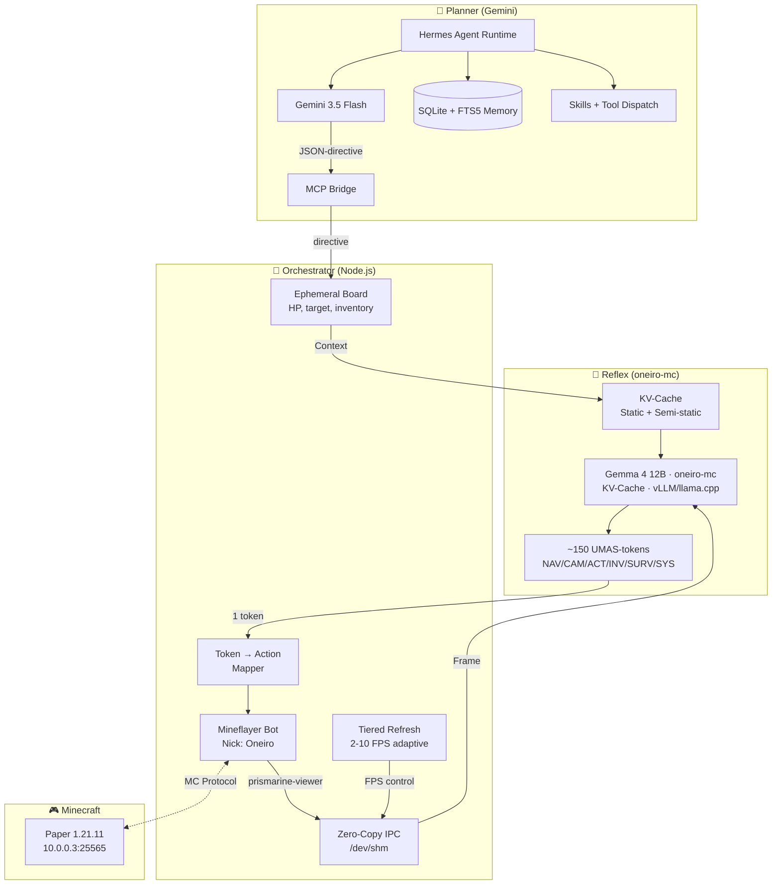
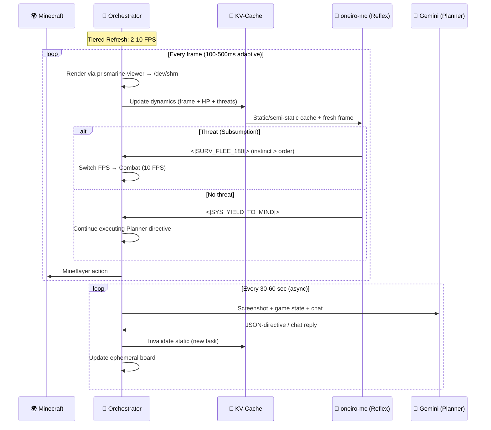

# 🌙 Architecture Oneiro — Dual-Agent VLA

> **Vision-Language-Action** — two agents, one orchestrator, zero mods
> Updated: 2026-07-08

---

## Overview

Oneiro — embodied VLA-agent consisting of **two neural agents** and **one orchestrator script**. Unlike single-threaded LLM bots (Mindcraft, Voyager), Oneiro separates **fast reflexes** and **slow planning** into different models, inspired by the biological nervous system. A future third agent (Social) for voice and emotion is planned post-MVP.

### Positioning among VLA-agents

| Agent | Approach | Action Space | Limitations |
|---|---|---|---|
| **Voyager** (2023) | GPT-4 → JS code | High-level API (Mineflayer) | No vision (text state), slow |
| **STEVE-1** (2024) | VPT + MineCLIP | Low-level (keyboard/mouse) | No language, no planning |
| **GROOT** (2024) | Video Encoder-Decoder | Low-level (keyboard/mouse) | Learns from video, no instructions |
| **JARVIS-VLA** (2025) | VLM + Action Head | Behavior tokens | Single model, no reflex/plan separation |
| **OmniJARVIS** (2025) | Unified tokenization | Behavior tokens | Everything in one transformer (heavy) |
| **OpenHA** (2025) | Chain of Action | Hierarchical | Closer to us, but monolithic VLA |
| **Oneiro** (2026) | **Dual-Agent + Subsumption** | **UMAS macro-tokens** | Our approach ↓ |

**Key difference of Oneiro:** Separation into Reflex (Gemma 4 12B, <100ms) and Planner (Gemini, 30-60s) allows **simultaneously** having fast instincts AND deep planning. JARVIS cannot flee from a creeper in 100ms because its single model is busy generating chain-of-thought.

---

## Agents

### 🦴 Agent 1: Oneiro Reflex (Motor Cortex)

| Parameter | Value |
|---|---|
| **Model** | Gemma 4 12B — fine-tuned as `oneiro-mc` ([Celestis-ai/oneiro-mc](https://huggingface.co/Celestis-ai/oneiro-mc) on HuggingFace) |
| **Training** | Fine-tuned on PLAICraft data for UMAS action tokens |
| **Output mode** | Single-token classification |
| **Latency** | < 100ms (with KV-Cache: ~30-50ms) |
| **Input** | Frame + full context (task, inventory, threats, directive) |
| **Output** | One UMAS macro-token |
| **Served via** | vLLM (ROCm) or llama.cpp (GGUF) |
| **Inference mode** | `max_new_tokens=1` + **Static Logit Bias** (logit-bias mask) |
| **Hackathon MVP fallback** | Rule-based SafetyGuard (TypeScript) |

**Role:** Not a dumb stub, but a **conscious reflex**. The model sees the full context: what it's doing, what the global task is, where it's going, what's in the inventory. But it **decides instantly** — one token in one forward pass.

> ⚠️ **Logit Bias:** At inference the model can choose ONLY from ~150 UMAS-tokens
> via **Static Logit Bias** (logit-bias mask: UMAS = 0, rest = -inf). This eliminates hallucinations with no overhead.
>
> ⚠️ vLLM supports `logit_bias` / `allowed_token_ids` natively; llama.cpp supports
> grammar-constrained generation. Both approaches restrict output to UMAS tokens
> with negligible overhead (<1ms).

---

### 🧠 KV-Cache + Tiered Refresh (Rich context without losing speed)

**Problem:** How to give the reflex model full context and not kill 100ms?

**Solution:** KV-Cache with three update layers. Between frames 90% of context doesn't change — we cache it:

```
┌──────────────────────────────────────────────────────────┐
│           ONEIRO CONTEXT (KV-Cache)                      │
│                                                           │
│ 🔒 STATIC (updated every 30-60 sec by Planner)           │
│    ├─ System prompt ("You are Oneiro reflex...")         │
│    ├─ Global task ("Building base at X:105")             │
│    ├─ Personality / lore from Hermes memory              │
│    └─ Prefill: CACHED, ~0ms                              │
│                                                           │
│ 🔄 SEMI-STATIC (updated every 1-2 sec)                   │
│    ├─ Inventory (what's in slots, durability)            │
│    ├─ Nearby entities (mobs, players, drops)             │
│    ├─ Directive from Planner (MINE_IRON / BUILD / EXPLORE)│
│    ├─ Task progress ("Mined 24/64 cobblestone")          │
│    └─ Prefill: partial recompute, ~10-15ms               │
│                                                           │
│ ⚡ DYNAMIC (every frame)                                  │
│    ├─ Current screenshot (frame from prismarine-viewer)  │
│    ├─ HP / Hunger / Position (numbers)                   │
│    ├─ Immediate threats (from Orchestrator)              │
│    └─ Prefill: ~20-30ms for 1 frame                      │
│                                                           │
│ 🎯 GENERATION: 1 UMAS-token = ~5-10ms                    │
│                                                           │
│ TOTAL: ~30-50ms (with cache) ✅                           │
└──────────────────────────────────────────────────────────┘
```

**The oneiro-mc prompt (every frame) looks rich:**

```
[SYSTEM] <|TASK_REFLEX|> You are Oneiro. Output exactly 1 macro-token.
Survival overrides directives.

[GLOBAL TASK] Building a bridge to the village. Stage: mining cobblestone.
[PLANNER DIRECTIVE] MINE_COBBLESTONE (target: X:98 Y:62 Z:-15)
[PROGRESS] Mined 24/64 cobblestone.

[INVENTORY] Slot0:Iron_Pickaxe(dur:187) Slot1:Cobblestone×24
            Slot2:Bread×3 Slot3:Shield
[ARMOR] Iron Helmet, Iron Chestplate, -, Iron Boots
[HP] 18/20  [HUNGER] 17/20  [POS] X:97.3 Y:63 Z:-14.8

[ENVIRONMENT] Time: day. Biome: Plains. Safe:true
[DYNAMICS] Threats: None. Bot: dy:0 (stable)
[HISTORY] T-3:SYS_YIELD -> T-2:SYS_YIELD -> T-1:ACT_MINE_TARGET

[FRAME] current_frame.jpg</img>
```

→ Answer: `<|SYS_YIELD_TO_MIND|>` (everything is safe, continuing to execute the plan)

**Example with a threat (Combat 10 FPS):**
```
[DYNAMICS] Threats: Creeper@3m (v: +4m/s, approaching!). Bot: dy:-3.9 (falling!)
[HISTORY] T-3:NAV_FWD -> T-2:NAV_JUMP -> T-1:CAM_LOCK_THREAT
```
→ Answer: `<|SURV_FLEE_180|>` (creeper approaching → instinct)

> ⚠️ **Temporal Context** solves the problem of "temporal blindness":
> From a single frame the reflex model won't understand — is the creeper approaching or fleeing,
> is the bot falling or jumping. Textual cues of velocity and action history
> give the model inertia without additional frames.

### Adaptive frame rate (Tiered Refresh)

Not everything needs 10 FPS. The Orchestrator dynamically switches the mode:

| Mode | FPS | Latency | When | Context |
|---|---|---|---|---|
| 🔴 Combat | 10 FPS | 100ms | Hostile mob ≤ 8 blocks | Minimum: frame + HP + threats |
| 🟡 Active | 5 FPS | 200ms | Active work (mining, building) | + inventory + task |
| 🟢 Safe | 2 FPS | 500ms | No threats, peaceful zone | + history + full state |
| 😴 Idle | 0.5 FPS | 2000ms | AFK / observation | Everything + reflection from Planner |

```
Orchestrator sees a hostile mob → switches to 10 FPS (Combat)
Mob killed → 3 sec buffer → back to Active / Safe
```

---

### 🧠 Agent 2: Oneiro Planner (Prefrontal Cortex)

| Parameter | Value |
|---|---|
| **Model** | Gemini 3.5 Flash (API) |
| **Runtime** | Hermes Agent |
| **Latency** | 30-60 seconds (asynchronous) |
| **Input** | Screenshot + game state + memory + chat |
| **Output** | JSON-directive for oneiro-mc / text for chat |
| **Memory** | SQLite + FTS5 (via Hermes) |
| **Capabilities** | Multimodality, skills, provider routing, tool dispatch, function calling |
| **Body connection** | MCP bridge |

**Role:** Planner, personality, builder. Has long-term memory (SQLite+FTS5 via Hermes Agent), communicates with players in chat in a philosophical style. Gives orders to oneiro-mc via JSON-directives through the MCP bridge.

```json
{
  "directive": "BUILD_TASK",
  "target_coordinate": {"x": 105, "y": 64, "z": -20},
  "block_type": "minecraft:oak_log"
}
```

**Critical:** While Planner "thinks" (30-60 sec), Reflex works autonomously on reflexes. The agent never "freezes" waiting for strategy.

---

### 🎙️ Agent 3: Social (Future)

| Parameter | Value |
|---|---|
| **Model** | Gemini 3.5 Flash Live / GPT Realtime 2.1 mini (future) |
| **Scope** | Voice + emotion, decoupled from movement |
| **Status** | Out of scope for hackathon MVP |

**Role:** Real-time voice interaction and emotional expression. Decoupled from movement and reflexes — the Social agent handles conversation and personality expression while Reflex and Planner handle body control and strategy. This agent is planned for post-MVP development.

---

## 📮 Orchestrator (Node.js) — Finite State Machine

A regular Mineflayer bot. **Has no intelligence.** Controlled by a strict FSM:

### FSM States

```
┌──────────┐ Planner directive ┌─────────────────────┐
│   IDLE   │ ───────────────→ │ EXECUTING_DIRECTIVE │
│  0.5 FPS │ ←─────────────── │     2-5 FPS         │
└──────────┘  TASK_COMPLETE   └─────────┬───────────┘
                                        │ SURV_ token
                                        ↓
┌────────────┐  threat gone  ┌──────────────────────┐
│  RECOVERY  │ ←──────────── │ SUBSUMPTION_OVERRIDE │
│  2 FPS     │               │      10 FPS          │
└──────┬─────┘               └──────────────────────┘
       │ unstuck / new directive
       ↓
     IDLE / EXECUTING_DIRECTIVE
```

| State | FPS | Description | Entry trigger |
|---|---|---|---|
| **IDLE** | 0.5 | Waits for plan from Planner, oneiro-mc on standby | No directive / SYS_TASK_COMPLETE |
| **EXECUTING_DIRECTIVE** | 2-5 | Pathfinder guides the bot, oneiro-mc outputs SYS_YIELD | Planner directive received |
| **SUBSUMPTION_OVERRIDE** | 10 | `bot.pathfinder.stop()`, oneiro-mc controls | SURV_ token from oneiro-mc |
| **RECOVERY** | 2 | Exit from being stuck | Watchdog timeout / 3× SYS_STUCK |

### Ephemeral Board (In-memory Singleton)

```typescript
interface EphemeralBoard {
  // Written by Planner Agent (via Hermes)
  planner_directive: {
    id: string;
    intent: 'MINE_TASK' | 'BUILD_TASK' | 'CRAFT_TASK' | 'FOLLOW_PLAYER' | 'EXPLORE' | 'IDLE' | 'GOTO';
    target?: string;
    coords?: { x: number; y: number; z: number };
    priority: 'normal' | 'urgent';
  } | null;

  // Updated by Mineflayer (every tick)
  agent_state: {
    hp: number;
    hunger: number;
    pos: { x: number; y: number; z: number };
    velocity: { dx: number; dy: number; dz: number }; // Textual Velocity
    safe: boolean;
  };

  // Computed by Orchestrator
  progress_context: string;  // "Iron ore collected: 3/10"
  action_history: string[];  // Last 3 UMAS-tokens
  fsm_state: 'IDLE' | 'EXECUTING_DIRECTIVE' | 'SUBSUMPTION_OVERRIDE' | 'RECOVERY';
  stuck_counter: number;     // Watchdog
}
```

### Error Recovery (Watchdog)

```typescript
// In the reflex response processing loop:
if (umas_token === 'SYS_STUCK') {
  board.stuck_counter++;
}
if (board.stuck_counter >= 3 || positionUnchanged(2000)) {
  // Blind evade
  bot.setControlState('jump', true);
  bot.setControlState('back', true);
  setTimeout(() => {
    bot.clearControlStates();
    board.stuck_counter = 0;
  }, 1500);
  // If it didn't help → IDLE + Planner webhook
  if (board.stuck_counter >= 6) {
    board.fsm_state = 'IDLE';
    await callPlanner({ event: 'CRITICAL_STUCK', pos: board.agent_state.pos });
  }
}
```

### Feedback Loop (Orchestrator → Planner)

```typescript
// Subscription to task completion events
bot.inventory.on('updateSlot', () => {
  if (checkDirectiveComplete(board.planner_directive)) {
    board.fsm_state = 'IDLE';
    await callPlanner({
      event: 'TASK_COMPLETE',
      result: `${board.planner_directive.target} gathered`,
      inventory_snapshot: getInventory()
    });
  }
});
```

### Responsibilities
1. **FSM** — manages transitions between states
2. **Zero-Copy IPC** (`/dev/shm`) — prismarine-viewer → raw RGB888 → Python mmap
3. **Ephemeral Board** — single source of truth for inter-agent communication
4. **UMAS Mapper** — maps tokens to Mineflayer actions ([tools.md](tools.md))
5. **Tiered Refresh** — switches FPS based on FSM state
6. **KV-Cache Manager** — invalidates semi-static data on changes
7. **Watchdog** — detects looping and SYS_STUCK
8. **Feedback** — notifies Planner about task completion and critical events

---

## UMAS — Universal Mineflayer Action Space

### Design principles

1. **Single-Token Classification** — exactly 1 forward pass, `max_new_tokens=1`
2. **Parameterized tokens are FORBIDDEN** — `<|ACT_PLACE|>` + `<|OAK_PLANKS|>` = 2 passes = 150ms+
3. **Contextual actions** — `ACT_MINE_TARGET` = "mine what you're looking at" (Orchestrator computes the block)
4. **Semantic inventory** — `INV_EQUIP_MELEE_BEST` instead of specific items
5. **~120-150 fixed tokens** in the model's extended vocabulary

### Full taxonomy (~120 tokens, 6 categories)

#### NAV_ — Navigation (~25 tokens)
```
<|NAV_FWD|>              — step forward
<|NAV_BWD|>              — step backward
<|NAV_STRAFE_L|>         — strafe left
<|NAV_STRAFE_R|>         — strafe right
<|NAV_FWD_SPRINT|>       — sprint forward
<|NAV_BWD_JUMP|>         — jump backward (evade)
<|NAV_FWD_SPRINT_JUMP|>  — sprint-jump
<|NAV_JUMP|>             — jump in place
<|NAV_SWIM_UP|>          — swim up
<|NAV_SWIM_DOWN|>        — swim down
<|NAV_SNEAK_FWD|>        — sneak + forward (bridging)
<|NAV_SNEAK_BWD|>        — sneak + backward
<|NAV_FREEZE|>           — stop (Creaking from 1.21.4!)
<|NAV_DISMOUNT|>         — dismount (1.21.11)
<|NAV_MOUNT|>            — mount
... (+10 combo/variants)
```

#### CAM_ — Camera and aiming (~10 tokens)
```
<|CAM_PITCH_UP_15|>      — camera up 15°
<|CAM_PITCH_DOWN_15|>    — camera down 15°
<|CAM_YAW_L_30|>         — turn left 30°
<|CAM_YAW_R_30|>         — turn right 30°
<|CAM_YAW_L_90|>         — sharp turn left
<|CAM_YAW_R_90|>         — sharp turn right
<|CAM_LOCK_THREAT|>      — aim at nearest threat ⭐
<|CAM_LOCK_TARGET|>      — aim at target block
<|CAM_LOOK_DOWN|>        — look down (bridging, MLG)
<|CAM_LOOK_UP|>          — look up (pillaring)
```

#### ACT_ — Contextual interaction (~20 tokens)
```
<|ACT_ATK_MELEE|>        — hit with what's in hand
<|ACT_ATK_RANGED|>       — shoot/throw (bow, Spear 1.21.11)
<|ACT_MINE_TARGET|>      — mine block in crosshair
<|ACT_PLACE_ACTIVE|>     — place block from hand
<|ACT_INTERACT_TARGET|>  — open/press (chest, Copper Bulb, door)
<|ACT_USE_ACTIVE|>       — use (food, potion, bow)
<|ACT_SHIELD_UP|>        — raise shield
<|ACT_SHIELD_DOWN|>      — lower shield
<|ACT_DROP_ACTIVE|>      — drop item
<|ACT_PICKUP_NEAR|>      — pick up nearby drop
<|ACT_THROW_SPEAR|>      — throw spear (Mounts of Mayhem)
... (+9 specific)
```

#### INV_ — Smart inventory (~20 tokens)
```
<|INV_EQUIP_MELEE_BEST|>   — best melee weapon
<|INV_EQUIP_RANGED|>       — bow / crossbow
<|INV_EQUIP_SHIELD|>       — shield
<|INV_EQUIP_PICKAXE_BEST|> — best pickaxe
<|INV_EQUIP_AXE_BEST|>     — best axe
<|INV_EQUIP_SHOVEL_BEST|>  — best shovel
<|INV_EQUIP_WATER_BUCKET|> — water bucket (MLG!)
<|INV_EQUIP_JUNK_BLOCK|>   — dirt/stone for building
<|INV_EQUIP_FOOD_BEST|>    — best food
<|INV_EQUIP_SPEAR|>        — spear (1.21.11)
<|INV_HOTBAR_NEXT|>        — next hotbar slot
<|INV_HOTBAR_PREV|>        — previous slot
... (+8 variants)
```

#### SURV_ — Survival instincts, subsumption (~15 tokens)
```
<|SURV_FLEE_180|>          — turn around + sprint-jump away ⭐
<|SURV_SHIELD_UP|>         — emergency shield
<|SURV_EAT_NOW|>           — emergency food (HP < 8)
<|SURV_WATER_BUCKET_MLG|>  — MLG water bucket on fall
<|SURV_BURY_SELF|>         — dig 3 blocks down + enclose
<|SURV_DODGE_LEFT|>        — dodge (arrow, fireball)
<|SURV_DODGE_RIGHT|>       — dodge
<|SURV_PILLAR_UP|>         — pillar up from mobs
<|SURV_RETREAT_SAFE|>      — retreat to safe zone
<|SURV_BLOCK_CREEPER|>     — wall off creeper with blocks
... (+5 situational)
```

#### SYS_ — System orchestration (~5 tokens)
```
<|SYS_YIELD_TO_MIND|>     — "Everything is safe, continue plan" ⭐ (most frequent!)
<|SYS_REQ_MIND_UPDATE|>   — "Environment changed, request new strategy"
<|SYS_TASK_COMPLETE|>      — "Current action completed"
<|SYS_STUCK|>              — "Stuck, need help"
<|SYS_WAIT|>               — "Waiting (crafting in progress, furnace running)"
```

> `<|SYS_YIELD_TO_MIND|>` — **the most frequent token** (~60-70% of output).
> Means: "no threats, visual check passed, Orchestrator continues
> executing the text directive of the Planner-agent (crafting, navigation, etc.)"

---

## Subsumption (Suppression)

Basic survival instincts **override** the text directive:

```
Priority:
  [1] SURV_ tokens    — instinct (creeper, lava, fall)
  [2] NAV_ / ACT_     — executing Planner directive
  [3] SYS_YIELD       — "all good, continue plan"

oneiro-mc is running to place a block (Planner directive)
  → A Creeper@3m appears on the frame
  → Reflex: <|SURV_FLEE_180|> (instinct > order)
  → Creeper killed/exploded
  → Next frame: no threats → <|SYS_YIELD_TO_MIND|>
  → Orchestrator continues BUILD_TASK
```

---

## Fine-tuning Pipeline (Reflex Blueprint)

The `oneiro-mc` model (Gemma 4 12B) is fine-tuned **specifically for reflexes** — producing UMAS action tokens in a single forward pass. It is **not** trained for planning, reasoning, or multi-turn dialogue. Planning is handled by the cloud-based Planner agent (Gemini 3.5 Flash via Hermes).

### PLAICraft data — UMAS action-token training

The primary training corpus comes from **PLAICraft** gameplay data, annotated with UMAS macro-tokens. Each example maps a game state (frame + context) to exactly one UMAS action token, teaching the model fast reflexive responses.

### Minecraft knowledge — Supplementary semantic context

~950-1100 recipes are embedded into weights via 4 types of Q&A to give the model semantic understanding of Minecraft items and mechanics (improves reflex quality, not planning):

| Type | Example | Goal |
|---|---|---|
| **Direct QA** | "How to make a Mace?" → "Heavy Core + Breeze Rod" | Direct knowledge |
| **Dependency Chain** | "Path from scratch to Enchanting Table?" → dependency tree | Knowledge graph |
| **Reverse Lookup** | "Found Resin Clump. What to do?" → "Smelt / Armor Trim" | Reverse lookup |
| **Resource Reasoning** | "3 iron + zombies around. Pickaxe or sword?" → "Sword is higher priority" | Strategy |

**Data source:** `data/minecraft/recipes/*.json` from JAR → parsing → Q&A generation via Gemini 1.5 Flash.

### Data Mixture (~60-80K examples)

| Task | Share | Input type | Output type |
|---|---|---|---|
| `<\|TASK_REFLEX\|>` (normal gameplay) | 45% | Frame + state | 1 UMAS-token |
| `<\|TASK_SUBSUMPTION\|>` (instincts) | 20% | Frame + state + contradicting directive | 1 SURV_ token |
| `<\|TASK_KNOWLEDGE\|>` (MC knowledge) | 25% | Text question | Text answer |
| Replay Buffer (general dialogues) | 10% | Text | Text |

### LoRA Hyperparameters

| Parameter | Value | Rationale |
|---|---|---|
| **Rank** | 64–128 | Balance of capacity and speed |
| **Alpha** | 128–256 | 2× Rank (standard) |
| **Target modules** | q_proj, k_proj, v_proj, o_proj, gate_proj, up_proj, down_proj | All attention + FFN |
| **🚨 UNFROZEN** | embed_tokens, lm_head | New UMAS-tokens must be trained |
| **Precision** | bfloat16 | Standard for 12B models |
| **Optimizer** | AdamW | Standard |

### Example format (Reflex)
```json
{
  "conversations": [
    {
      "from": "system",
      "value": "<|TASK_REFLEX|> You are Oneiro reflex. Output EXACTLY ONE macro-token. Survival overrides directives."
    },
    {
      "from": "user",
      "value": "frame.jpg</img>\nSTATE: HP:20 Hunger:18 Pos:X:97 Y:63 Z:-14\nINV: Slot0:Iron_Pickaxe Slot1:Cobblestone×24\nTHREATS: Creeper@3m approaching!\nDIRECTIVE: MINE_COBBLESTONE"
    },
    {
      "from": "assistant",
      "value": "<|SURV_FLEE_180|>"
    }
  ]
}
```

### Example format (Knowledge)
```json
{
  "conversations": [
    {
      "from": "system",
      "value": "<|TASK_KNOWLEDGE|> You are Oneiro expert on Minecraft 1.21.11."
    },
    {
      "from": "user",
      "value": "I have 1 iron ingot and 2 sticks. How to craft a Spear?"
    },
    {
      "from": "assistant",
      "value": "The Spear is crafted in a crafting table: iron ingot on top center, 2 sticks diagonally downward. The spear can be thrown and returns with the Loyalty enchantment."
    }
  ]
}
```

---

## Full component diagram



## Decision-making cycle



---

## Account and connection

| Parameter | Value |
|---|---|
| **Name** | Oneiro |
| **Account type** | Ely.by (`Oneiro`) |
| **Skin** | Dreamcore style (pale figure, empty eyes) |
| **Connection** | Mineflayer → Velocity:25565 |
| **Authorization** | ElyMojang v3 (type: ELYBY) |

## Limitations and risks

| Risk | Mitigation |
|---|---|
| Bot loops | Watchdog: if no actions for 30 sec → restart solution |
| Bot griefs | Tool whitelist: no TNT, no lava casts |
| Bot spams chat | Rate limit: 1 message / 5 sec |
| Reflex model hallucinates action | **Static Logit Bias** — logit-bias mask (UMAS = 0, rest = -inf, <1ms overhead) |
| Planner delayed | oneiro-mc autonomous on reflexes, doesn't wait for Planner |
| Bot stuck | `<\|SYS_STUCK\|>` → pathfinder timeout → teleport |
| IPC bottleneck | Zero-Copy via /dev/shm, no buffer copying |
| 12B memory footprint | vLLM (ROCm) or llama.cpp (GGUF) — fits comfortably in ~24 GB VRAM (bf16) |
| Catastrophic forgetting | 10% replay buffer in training data |

---

## Related Documents

| Document | Description |
|---|---|
| [README.md](../README.md) | Master Summary & Blueprint |
| [tools.md](tools.md) | Tool catalog (MCP + macro-tokens) |
| [weaver.md](weaver.md) | The Weaver Pipeline (data collection) |
| [ADR-001-architecture.md](ADR-001-architecture.md) | ADR: Dual-Model Architecture |
| [dataset.md](../dataset.md) | Dataset specification (~3M frames) |

<p align="center">
  <sub>📅 Updated: 2026-07-08</sub>
</p>
